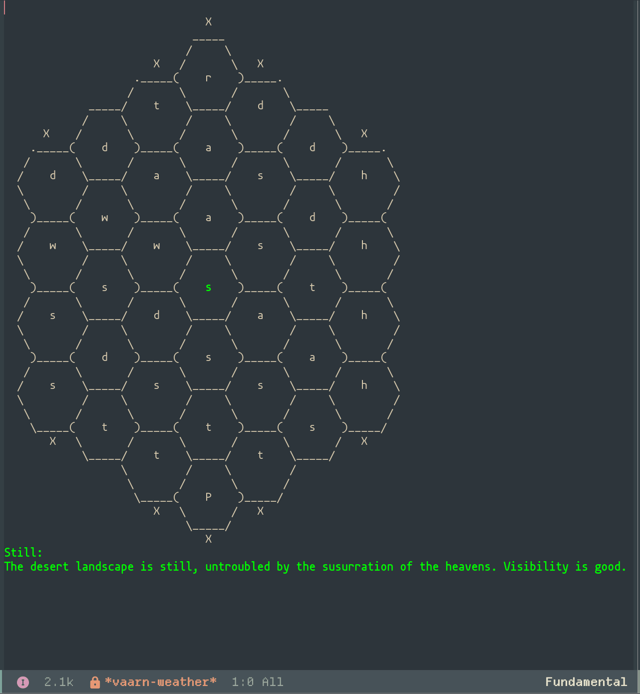

# Vaarn.el
A vaults of vaarn emacs package to help running games via org mode.

## Weather

`vaarn-weather-hex` brings up the weather hex map. `vaarn-move-weather-hex` will roll and move around the map. The coordinate is saved between sessions but can be reset with `vaarn-reset-weather`.

## Acknowledgement

Attribution to the brilliant Leo Hunt at [vaultsofvaarn](https://vaultsofvaarn.com/). Details on the licesnse for vaarn can be found with the [srd](https://vaarn.github.io/#/acknowledgements)

A load of code was ~~stolen~~ inspired by the work for Howard Abrams and his emacs packages, mainly [emacs-ironsworn](https://gitlab.com/howardabrams/emacs-ironsworn).
